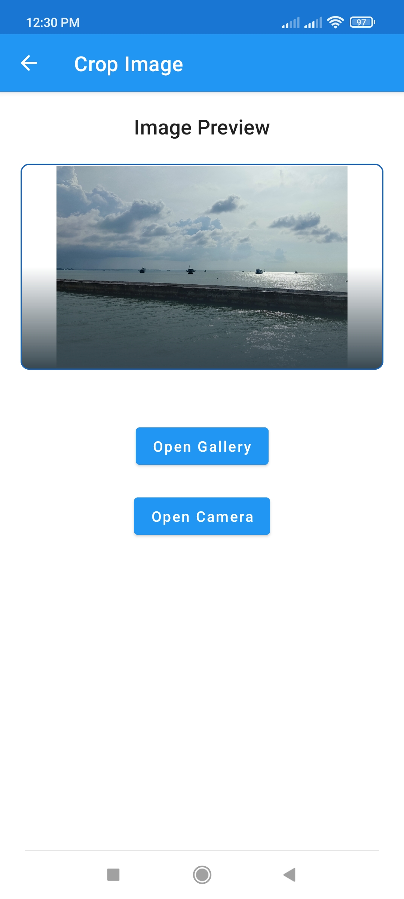

#  Activity Result Contract with async & await (Asynchronous) - Android App Module

### **App Features Activity Result Contract** :

-   **_ActivityResultContracts_**
    -   **Permissions**
        -   Request Permission
        -   Multiple Request Permissions
    -   **Image**
        -   Pick Image from **Camera**
        -   Select Image from **Gallery**
        -   **CropImageActivity** with Pick Image or Select Image
    -   **Document**
        -   Open Single Document
        -   Open Multiple Documents
-   **_CoroutineScope_**
    -   **GlobalScope**
    -   **async{}**
    -   **await()**

<br>

## Design UI App Activity Result Contract

<!-- ### **`Preview Activity Result Contract`**

 -->

### **`Preview UI FirebaseAuth-Google`**

|         Name Page         |                         Preview UI                         |                         Preview UI                         |
| :-----------------------: | :--------------------------------------------------------: | :--------------------------------------------------------: |
|          `Home`           |  |                           `none`                           |
|       `Permissions`       |  |  |
|       `Crop Image`        |  |  |
|  `Open Single Document`   |  |  |
| `Open Multiple Documents` |  |  |

<br>

## Dependencies used

```groovy
    // Kotlin Coroutine
    implementation 'androidx.activity:activity-ktx:1.4.0'
    // Image Cropper
    api 'com.theartofdev.edmodo:android-image-cropper:2.8.0'
```

### Integration Step Used Binding in Kotlin

1. Add **viewBinding `true`** <a href="./app/build.gradle">`build.gralde (Module)`</a>

```groovy
android {
   ...
   buildFeatures {
      viewBinding true
   }
}
```

2. Activity Kotlin Class

```kotlin
class MainActivity : AppCompatActivity() {

    /** Add this */
    private lateinit var binding: ActivityMainBinding

    override fun onCreate(savedInstanceState: Bundle?) {
        super.onCreate(savedInstanceState)
        /** Add this */
        binding = ActivityMainBinding.inflate(layoutInflater)

        /** Change this */
        setContentView(binding.root)

        /** Without findViewById */
        binding.textView.text = "Bye bye findViewById"
    }
}
```

3. Activity Java Class

```java
public class MainActivity extends AppCompatActivity {

    /** Add this */
    private ActivityMainBinding binding;

    @Override
    protected void onCreate(Bundle savedInstanceState) {
        super.onCreate(savedInstanceState);
        /** Add this */
        binding = ActivityMainBinding.inflate(getLayoutInflater());

        /** Change this */
        setContentView(binding.getRoot());

        /** Without findViewById */
        binding.textView.setText("Bye bye findViewById");
    }
}
```

**binding** in kotlin can be used directly without initializing **findViewById** on widgets in layout xml
